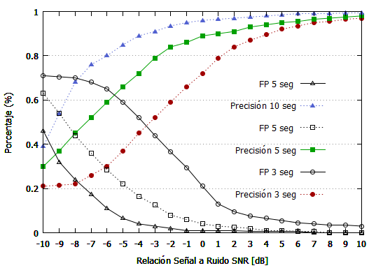

# AudioFingerprintTest
-------------------------------
This repository was created in order to evaluate an fingerprinting algorithm with some degraded audio samples, see the parametrization process here [ArtículoETCM2017.pdf](https://github.com/JoseLMedinaC/AudioFingerprintTest/blob/master/Art%C3%ADculoETCM2017.pdf)
# Videos
Multimedia content that was uploaded to the server
# AudioSamples
Some degraded audio samples with various size and #SNR (file_(size)_SNR_(#).wav)  
# sendfile.py
Python script for connecting to server and loading an audio sample in order to retrieve a link of additional information about the audio sample.
By default the script uses input.wav, but it could be changed by another file with the following extension "wav, mp4, mp3, 3gp"
```python
file='input.wav'	
```
# input.wav
This file will be uploaded to the server 
# Quickstart
```bash
$ git clone https://github.com/JoseLMedinaC/AudioFingerprintTest.git ./AudioFingerprintTest
$ cd AudioFingerprintTest
$ python sendfile.py
```
# Results
This plot is the result of computing various audios samples varying SNR and modularity.

Precisión=>Accuracy

FP========>False Positive Rate



